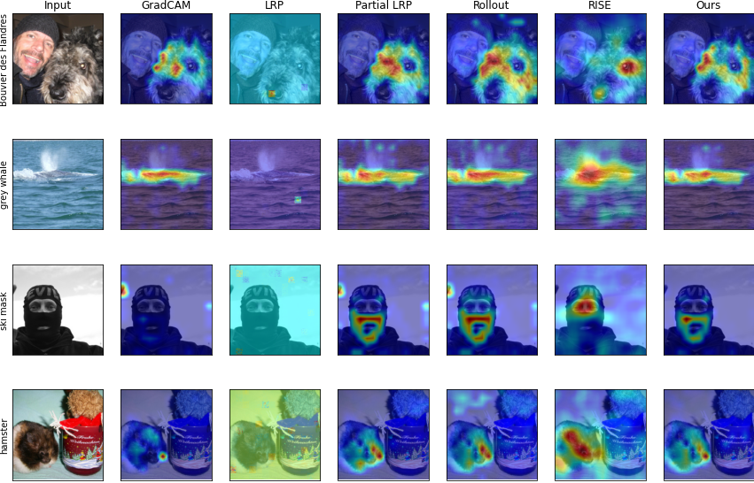

# Transformer-Explainability
Implementation of the explainability method for Transfomer architecture proposed in [Transformer Interpretability Beyond Attention Visualization](https://arxiv.org/abs/2012.09838). 

We find a closed form for relevance propagation for each layer type, which **reduces computational costs** by 38% and incrementally **improves performance**. Analysis of the method and results available in our [project report](https://github.com/franciscojferrari/Transformer-Explainability/blob/main/Project%20report.pdf).

This project was part of [DD2412 - Deep Learning, Advanced](https://www.kth.se/student/kurser/kurs/DD2412?l=en) at KTH. 

Please refere to the ViT or BERT folder to run the different experiements

----
### Results
Example of saliency maps generated to explain the ViT's prediction. For further examples and quantitative results, refer to our [project report](https://github.com/franciscojferrari/Transformer-Explainability/blob/main/Project%20report.pdf).

