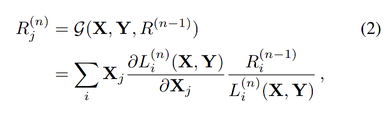
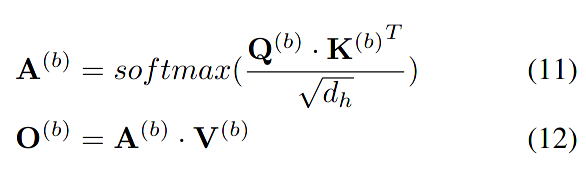
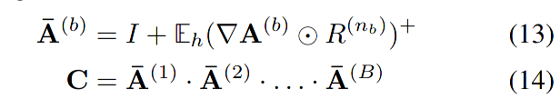
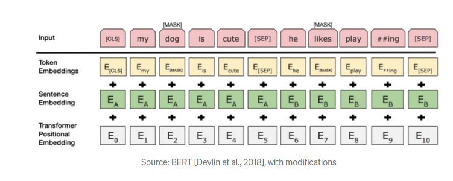

# Help notes by Sandor

## Relevance

The relevance for a block b, of layer n, is gotten by

## Attention

A^(b) = sofmax(Q^(b)*K^(b)/sqrt(d_h)) is the attention in each block of transformers b for query and key Q^(b) K^(b) in block b.

## Method

Operation: max(0, v) is denoted as v⁺

## Architechture relevant for classification fine tuning

## Relevance for layer zero (R⁽⁰⁾)

